# CS-Cryptography

Digital Signature Methods Comparison
ElGamal Digital Signature
The ElGamal signature scheme is based on the difficulty of computing discrete logarithms in a finite field. It was described by Taher Elgamal in 1985.
Key Concepts

Based on the Diffie-Hellman key exchange
Security relies on the discrete logarithm problem
Produces relatively large signatures (two integers)
Probabilistic signature algorithm (produces different signatures for the same message)

Let me create a flowchart for the ElGamal signature scheme:

```mermaid
flowchart TD
    subgraph "Key_Generation"
    A[Select prime p and generator g of subgroup of order q] --> B[Choose random private key x from 1 to q-1]
    B --> C[Compute public key y as g raised to x mod p]
    C --> D[Public key: p, q, g, y; Private key: x]
    end
    
    subgraph "Signature_Generation"
    E[Choose random k from 1 to q-1] --> F[Compute r as g raised to k mod p]
    F --> G[Compute e as H of concatenated m and r]
    G --> H[Compute s as k plus x times e mod q]
    H --> I[Signature: e and s]
    end
    
    subgraph "Signature_Verification"
    J[Compute v as g raised to s times y raised to negative e mod p] --> K[Compute e' as H of concatenated m and v]
    K --> L{Is e equal to e'?}
    L -->|Yes| M[Signature Valid]
    L -->|No| N[Signature Invalid]
    end
```


Javascript Implementation :

```javascript
const crypto = require('crypto');
const BigInt = require('big-integer');

class ElGamalSignature {
  constructor() {
    // Default values for demonstration
    this.p = BigInt('13407807929942597099574024998205846127479365820592393377723561443721764030073546976801874298166903427690031858186486050853753882811946569946433649006084171');
    this.g = BigInt('11717829880366207009516117596335367088558084999998952205599979459063929499736583746670572176471460312928594829675428279466566527115212748467589894601965568');
    this.x = null; // Private key
    this.y = null; // Public key
  }

  // Generate key pair
  generateKeyPair() {
    // Choose a random private key x (1 < x < p-1)
    this.x = BigInt.randBetween(BigInt('2'), this.p.minus(BigInt('1')));
    
    // Calculate public key y = g^x mod p
    this.y = this.g.modPow(this.x, this.p);
    
    return {
      publicKey: {p: this.p.toString(), g: this.g.toString(), y: this.y.toString()},
      privateKey: {p: this.p.toString(), g: this.g.toString(), x: this.x.toString()}
    };
  }

  // Hash a message to a BigInt
  hashMessage(message) {
    const hash = crypto.createHash('sha256').update(message).digest('hex');
    return BigInt(hash, 16).mod(this.p.minus(BigInt('1')));
  }

  // Extended Euclidean Algorithm for modular inverse
  modInverse(a, m) {
    a = a.mod(m);
    for (let x = BigInt('1'); x.lesser(m); x = x.plus(BigInt('1'))) {
      if (a.multiply(x).mod(m).equals(BigInt('1'))) {
        return x;
      }
    }
    return BigInt('1');
  }

  // Sign a message
  sign(message, privateKey) {
    if (!this.x) {
      this.x = BigInt(privateKey.x);
      this.p = BigInt(privateKey.p);
      this.g = BigInt(privateKey.g);
    }
    
    // Hash the message
    const h = this.hashMessage(message);
    
    // Choose a random k (1 < k < p-1) such that gcd(k, p-1) = 1
    let k, r, s;
    const p_minus_1 = this.p.minus(BigInt('1'));
    
    do {
      k = BigInt.randBetween(BigInt('2'), p_minus_1);
      // Ensure k is coprime to p-1
    } while (BigInt.gcd(k, p_minus_1).notEquals(BigInt('1')));
    
    // Calculate r = g^k mod p
    r = this.g.modPow(k, this.p);
    
    // Calculate s = (h - x*r) * k^-1 mod (p-1)
    const k_inv = this.modInverse(k, p_minus_1);
    s = h.minus(this.x.multiply(r)).multiply(k_inv).mod(p_minus_1);
    
    // If s = 0, choose a different k
    if (s.equals(BigInt('0'))) {
      return this.sign(message, privateKey);
    }
    
    return {r: r.toString(), s: s.toString()};
  }

  // Verify a signature
  verify(message, signature, publicKey) {
    const p = BigInt(publicKey.p);
    const g = BigInt(publicKey.g);
    const y = BigInt(publicKey.y);
    const r = BigInt(signature.r);
    const s = BigInt(signature.s);
    
    // Check if 0 < r < p and 0 < s < p-1
    if (r.leq(BigInt('0')) || r.geq(p) || s.leq(BigInt('0')) || s.geq(p.minus(BigInt('1')))) {
      return false;
    }
    
    // Hash the message
    const h = this.hashMessage(message);
    
    // Calculate v1 = y^r * r^s mod p
    const v1 = y.modPow(r, p).multiply(r.modPow(s, p)).mod(p);
    
    // Calculate v2 = g^h mod p
    const v2 = g.modPow(h, p);
    
    // Verify v1 = v2
    return v1.equals(v2);
  }
}

// Usage example
function demonstrateElGamal() {
  const elgamal = new ElGamalSignature();
  const keyPair = elgamal.generateKeyPair();
  console.log('ElGamal Key Pair Generated:');
  console.log('Public Key:', keyPair.publicKey);
  console.log('Private Key: (secret)');
  
  const message = 'This is a test message for ElGamal signature';
  const signature = elgamal.sign(message, keyPair.privateKey);
  console.log('Signature:', signature);
  
  const isValid = elgamal.verify(message, signature, keyPair.publicKey);
  console.log('Signature Valid:', isValid);
}

demonstrateElGamal();
```