# CS-Cryptography

Digital Signature Methods Comparison
ElGamal Digital Signature
The ElGamal signature scheme is based on the difficulty of computing discrete logarithms in a finite field. It was described by Taher Elgamal in 1985.
Key Concepts

Based on the Diffie-Hellman key exchange
Security relies on the discrete logarithm problem
Produces relatively large signatures (two integers)
Probabilistic signature algorithm (produces different signatures for the same message)

Let me create a flowchart for the ElGamal signature scheme:

```mermaid
flowchart TD
    subgraph "Key_Generation"
    A[Select prime p and generator g of subgroup of order q] --> B[Choose random private key x from 1 to q-1]
    B --> C[Compute public key y as g raised to x mod p]
    C --> D[Public key: p, q, g, y; Private key: x]
    end
    
    subgraph "Signature_Generation"
    E[Choose random k from 1 to q-1] --> F[Compute r as g raised to k mod p]
    F --> G[Compute e as H of concatenated m and r]
    G --> H[Compute s as k plus x times e mod q]
    H --> I[Signature: e and s]
    end
    
    subgraph "Signature_Verification"
    J[Compute v as g raised to s times y raised to negative e mod p] --> K[Compute e' as H of concatenated m and v]
    K --> L{Is e equal to e'?}
    L -->|Yes| M[Signature Valid]
    L -->|No| N[Signature Invalid]
    end
```

