# CS-Cryptography

Digital Signature Methods Comparison
ElGamal Digital Signature
The ElGamal signature scheme is based on the difficulty of computing discrete logarithms in a finite field. It was described by Taher Elgamal in 1985.
Key Concepts

Based on the Diffie-Hellman key exchange
Security relies on the discrete logarithm problem
Produces relatively large signatures (two integers)
Probabilistic signature algorithm (produces different signatures for the same message)

Let me create a flowchart for the ElGamal signature scheme:

```mermaid
flowchart TD
    subgraph "Key_Generation"
    A[Select prime p and generator g of subgroup of order q] --> B[Choose random private key x from 1 to q-1]
    B --> C[Compute public key y as g raised to x mod p]
    C --> D[Public key: p, q, g, y; Private key: x]
    end
    
    subgraph "Signature_Generation"
    E[Choose random k from 1 to q-1] --> F[Compute r as g raised to k mod p]
    F --> G[Compute e as H of concatenated m and r]
    G --> H[Compute s as k plus x times e mod q]
    H --> I[Signature: e and s]
    end
    
    subgraph "Signature_Verification"
    J[Compute v as g raised to s times y raised to negative e mod p] --> K[Compute e' as H of concatenated m and v]
    K --> L{Is e equal to e'?}
    L -->|Yes| M[Signature Valid]
    L -->|No| N[Signature Invalid]
    end
```


Javascript Implementation :

```javascript
const crypto = require('crypto');
const BigInt = require('big-integer');

class ElGamalSignature {
  constructor() {
    // Default values for demonstration
    this.p = BigInt('13407807929942597099574024998205846127479365820592393377723561443721764030073546976801874298166903427690031858186486050853753882811946569946433649006084171');
    this.g = BigInt('11717829880366207009516117596335367088558084999998952205599979459063929499736583746670572176471460312928594829675428279466566527115212748467589894601965568');
    this.x = null; // Private key
    this.y = null; // Public key
  }

  // Generate key pair
  generateKeyPair() {
    // Choose a random private key x (1 < x < p-1)
    this.x = BigInt.randBetween(BigInt('2'), this.p.minus(BigInt('1')));
    
    // Calculate public key y = g^x mod p
    this.y = this.g.modPow(this.x, this.p);
    
    return {
      publicKey: {p: this.p.toString(), g: this.g.toString(), y: this.y.toString()},
      privateKey: {p: this.p.toString(), g: this.g.toString(), x: this.x.toString()}
    };
  }

  // Hash a message to a BigInt
  hashMessage(message) {
    const hash = crypto.createHash('sha256').update(message).digest('hex');
    return BigInt(hash, 16).mod(this.p.minus(BigInt('1')));
  }

  // Extended Euclidean Algorithm for modular inverse
  modInverse(a, m) {
    a = a.mod(m);
    for (let x = BigInt('1'); x.lesser(m); x = x.plus(BigInt('1'))) {
      if (a.multiply(x).mod(m).equals(BigInt('1'))) {
        return x;
      }
    }
    return BigInt('1');
  }

  // Sign a message
  sign(message, privateKey) {
    if (!this.x) {
      this.x = BigInt(privateKey.x);
      this.p = BigInt(privateKey.p);
      this.g = BigInt(privateKey.g);
    }
    
    // Hash the message
    const h = this.hashMessage(message);
    
    // Choose a random k (1 < k < p-1) such that gcd(k, p-1) = 1
    let k, r, s;
    const p_minus_1 = this.p.minus(BigInt('1'));
    
    do {
      k = BigInt.randBetween(BigInt('2'), p_minus_1);
      // Ensure k is coprime to p-1
    } while (BigInt.gcd(k, p_minus_1).notEquals(BigInt('1')));
    
    // Calculate r = g^k mod p
    r = this.g.modPow(k, this.p);
    
    // Calculate s = (h - x*r) * k^-1 mod (p-1)
    const k_inv = this.modInverse(k, p_minus_1);
    s = h.minus(this.x.multiply(r)).multiply(k_inv).mod(p_minus_1);
    
    // If s = 0, choose a different k
    if (s.equals(BigInt('0'))) {
      return this.sign(message, privateKey);
    }
    
    return {r: r.toString(), s: s.toString()};
  }

  // Verify a signature
  verify(message, signature, publicKey) {
    const p = BigInt(publicKey.p);
    const g = BigInt(publicKey.g);
    const y = BigInt(publicKey.y);
    const r = BigInt(signature.r);
    const s = BigInt(signature.s);
    
    // Check if 0 < r < p and 0 < s < p-1
    if (r.leq(BigInt('0')) || r.geq(p) || s.leq(BigInt('0')) || s.geq(p.minus(BigInt('1')))) {
      return false;
    }
    
    // Hash the message
    const h = this.hashMessage(message);
    
    // Calculate v1 = y^r * r^s mod p
    const v1 = y.modPow(r, p).multiply(r.modPow(s, p)).mod(p);
    
    // Calculate v2 = g^h mod p
    const v2 = g.modPow(h, p);
    
    // Verify v1 = v2
    return v1.equals(v2);
  }
}

// Usage example
function demonstrateElGamal() {
  const elgamal = new ElGamalSignature();
  const keyPair = elgamal.generateKeyPair();
  console.log('ElGamal Key Pair Generated:');
  console.log('Public Key:', keyPair.publicKey);
  console.log('Private Key: (secret)');
  
  const message = 'This is a test message for ElGamal signature';
  const signature = elgamal.sign(message, keyPair.privateKey);
  console.log('Signature:', signature);
  
  const isValid = elgamal.verify(message, signature, keyPair.publicKey);
  console.log('Signature Valid:', isValid);
}

demonstrateElGamal();
```

Schnorr Signature Scheme
The Schnorr signature scheme, developed by Claus Schnorr, is also based on the discrete logarithm problem but is simpler and more efficient than ElGamal.
Key Concepts

Based on discrete logarithm problem
Produces shorter, non-malleable signatures
Provably secure in the random oracle model
Supports native multi-signature aggregation
Deterministic (can produce the same signature for the same message)

Here's a flowchart for the Schnorr signature scheme:

```mermaid
flowchart TD
    subgraph "Key Generation"
    A[Select prime p and generator g of subgroup of order q] --> B[Choose random private key x from 1 to q-1]
    B --> C[Compute public key y = g^x mod p]
    C --> D[Public key: p, q, g, y; Private key: x]
    end
    
    subgraph "Signature Generation"
    E[Choose random k from 1 to q-1] --> F[Compute r = g^k mod p]
    F --> G[Compute e = H of m concatenated with r]
    G --> H[Compute s = k + x*e mod q]
    H --> I[Signature: e, s]
    end
    
    subgraph "Signature Verification"
    J[Compute v = g^s * y^-e mod p] --> K[Compute e' = H of m concatenated with v]
    K --> L{e == e'?}
    L -->|Yes| M[Signature Valid]
    L -->|No| N[Signature Invalid]
    end
```




```javascript
const crypto = require('crypto');
const BigInt = require('big-integer');

class SchnorrSignature {
  constructor() {
    // Default parameters
    this.p = BigInt('13407807929942597099574024998205846127479365820592393377723561443721764030073546976801874298166903427690031858186486050853753882811946569946433649006084171');
    this.q = BigInt('6703903964971298549787012499102923063739682910296196688861780721860882015036773488400937149083451713845015929093243025426876941405973284973216824503042085');
    this.g = BigInt('11717829880366207009516117596335367088558084999998952205599979459063929499736583746670572176471460312928594829675428279466566527115212748467589894601965568');
    this.x = null; // Private key
    this.y = null; // Public key
  }

  // Generate key pair
  generateKeyPair() {
    // Choose random x from {1, 2, ..., q-1}
    this.x = BigInt.randBetween(BigInt('1'), this.q.minus(BigInt('1')));
    
    // Calculate public key y = g^x mod p
    this.y = this.g.modPow(this.x, this.p);
    
    return {
      publicKey: {
        p: this.p.toString(),
        q: this.q.toString(),
        g: this.g.toString(),
        y: this.y.toString()
      },
      privateKey: {
        p: this.p.toString(),
        q: this.q.toString(),
        g: this.g.toString(),
        x: this.x.toString()
      }
    };
  }

  // Hash a message and a commitment to get the challenge
  hashMessageWithCommitment(message, commitment) {
    const hash = crypto.createHash('sha256')
                      .update(message)
                      .update(commitment.toString())
                      .digest('hex');
    return BigInt(hash, 16).mod(this.q);
  }

  // Sign a message
  sign(message, privateKey) {
    if (!this.x) {
      this.x = BigInt(privateKey.x);
      this.p = BigInt(privateKey.p);
      this.q = BigInt(privateKey.q);
      this.g = BigInt(privateKey.g);
    }
    
    // Choose random k from {1, 2, ..., q-1}
    const k = BigInt.randBetween(BigInt('1'), this.q.minus(BigInt('1')));
    
    // Calculate commitment r = g^k mod p
    const r = this.g.modPow(k, this.p);
    
    // Calculate challenge e = H(m || r)
    const e = this.hashMessageWithCommitment(message, r);
    
    // Calculate response s = k + x*e mod q
    const s = k.add(this.x.multiply(e)).mod(this.q);
    
    return {e: e.toString(), s: s.toString()};
  }

  // Verify a signature
  verify(message, signature, publicKey) {
    const p = BigInt(publicKey.p);
    const q = BigInt(publicKey.q);
    const g = BigInt(publicKey.g);
    const y = BigInt(publicKey.y);
    const e = BigInt(signature.e);
    const s = BigInt(signature.s);
    
    // Calculate v = g^s * y^-e mod p
    const y_inv_e = y.modPow(e, p).modInv(p);
    const v = g.modPow(s, p).multiply(y_inv_e).mod(p);
    
    // Calculate e' = H(m || v)
    const e_prime = this.hashMessageWithCommitment(message, v);
    
    // Verify e == e'
    return e.equals(e_prime);
  }
}

// Usage example
function demonstrateSchnorr() {
  const schnorr = new SchnorrSignature();
  const keyPair = schnorr.generateKeyPair();
  console.log('Schnorr Key Pair Generated:');
  console.log('Public Key:', keyPair.publicKey);
  console.log('Private Key: (secret)');
  
  const message = 'This is a test message for Schnorr signature';
  const signature = schnorr.sign(message, keyPair.privateKey);
  console.log('Signature:', signature);
  
  const isValid = schnorr.verify(message, signature, keyPair.publicKey);
  console.log('Signature Valid:', isValid);
}

demonstrateSchnorr();
```

Lamport Signature Scheme
The Lamport signature scheme, created by Leslie Lamport, is fundamentally different as it relies on one-way hash functions rather than number theory problems.
Key Concepts

Based on cryptographic hash functions (no complex number theory required)
One-time use only (each key pair can only sign one message)
Quantum-resistant (secure against quantum computer attacks)
Produces very large signatures
Fast verification (only requires hash computations)

Here's a flowchart for the Lamport signature scheme:

```mermaid
flowchart TD
    subgraph "Key Generation"
    A["Choose n random values x0,0...x0,n-1"] --> B["Choose n random values x1,0...x1,n-1"]
    B --> C["Compute y0,i = H(x0,i) for all i"]
    C --> D["Compute y1,i = H(x1,i) for all i"]
    D --> E["Public key: y0,0...y0,n-1, y1,0...y1,n-1"]
    E --> F["Private key: x0,0...x0,n-1, x1,0...x1,n-1"]
    end
    
    subgraph "Signature Generation"
    G["Compute message hash: h = H(m)"] --> H["For each bit i in h"]
    H --> I{"Bit i = 0?"}
    I -->|Yes| J["Include x0,i in signature"]
    I -->|No| K["Include x1,i in signature"]
    J & K --> L["Signature: s0, s1, ..., sn-1"]
    end
    
    subgraph "Signature Verification"
    M["Compute message hash: h = H(m)"] --> N["For each bit i in h"]
    N --> O{"Bit i = 0?"}
    O -->|Yes| P["Check if H(si) = y0,i"]
    O -->|No| Q["Check if H(si) = y1,i"]
    P & Q --> R{"All checks pass?"}
    R -->|Yes| S["Signature Valid"]
    R -->|No| T["Signature Invalid"]
    end
```



Javascript Implementation

```javascript
const crypto = require('crypto');

class LamportSignature {
  constructor(hashBits = 256) {
    this.hashBits = hashBits; // Number of bits in the hash (default: 256 for SHA-256)
  }

  // Generate a random byte string
  generateRandomBytes(length) {
    return crypto.randomBytes(length);
  }

  // Hash a byte string
  hash(data) {
    return crypto.createHash('sha256').update(data).digest();
  }

  // Generate key pair
  generateKeyPair() {
    const privateKey = {
      x0: Array(this.hashBits).fill().map(() => this.generateRandomBytes(32)),
      x1: Array(this.hashBits).fill().map(() => this.generateRandomBytes(32))
    };

    const publicKey = {
      y0: privateKey.x0.map(x => this.hash(x)),
      y1: privateKey.x1.map(x => this.hash(x))
    };

    return { publicKey, privateKey };
  }

  // Convert a message to a hash and then to bits
  messageToHashBits(message) {
    const hashBytes = this.hash(Buffer.from(message));
    const bits = [];
    
    // Convert hash bytes to bits
    for (let i = 0; i < Math.min(this.hashBits, hashBytes.length * 8); i++) {
      const byteIndex = Math.floor(i / 8);
      const bitIndex = i % 8;
      const bit = (hashBytes[byteIndex] >> (7 - bitIndex)) & 1;
      bits.push(bit);
    }
    
    return bits;
  }

  // Sign a message
  sign(message, privateKey) {
    const messageBits = this.messageToHashBits(message);
    const signature = [];
    
    // For each bit in the message hash
    for (let i = 0; i < messageBits.length; i++) {
      // If bit is 0, use x0[i], otherwise use x1[i]
      signature.push(messageBits[i] === 0 ? privateKey.x0[i] : privateKey.x1[i]);
    }
    
    return signature;
  }

  // Verify a signature
  verify(message, signature, publicKey) {
    const messageBits = this.messageToHashBits(message);
    
    // For each bit in the message hash
    for (let i = 0; i < messageBits.length; i++) {
      const hashOfSignature = this.hash(signature[i]);
      const expectedHash = messageBits[i] === 0 ? publicKey.y0[i] : publicKey.y1[i];
      
      // Compare hash of signature component with expected hash
      if (Buffer.compare(hashOfSignature, expectedHash) !== 0) {
        return false;
      }
    }
    
    return true;
  }
}

// Helper function to demonstrate Lamport signatures
function demonstrateLamport() {
  const lamport = new LamportSignature(8); // Using just 8 bits for demo brevity
  const keyPair = lamport.generateKeyPair();
  console.log('Lamport Key Pair Generated (showing only first few elements):');
  console.log('Public Key y0[0]:', keyPair.publicKey.y0[0].toString('hex'));
  console.log('Public Key y1[0]:', keyPair.publicKey.y1[0].toString('hex'));
  console.log('Private Key: (secret)');
  
  const message = 'This is a test message for Lamport signature';
  const signature = lamport.sign(message, keyPair.privateKey);
  console.log('Signature (first element):', signature[0].toString('hex'));
  
  const isValid = lamport.verify(message, signature, keyPair.publicKey);
  console.log('Signature Valid:', isValid);
  
  // Try to verify with a modified message
  const modifiedMessage = 'This is a MODIFIED test message for Lamport signature';
  const isValidModified = lamport.verify(modifiedMessage, signature, keyPair.publicKey);
  console.log('Modified Message Signature Valid:', isValidModified); // Should be false
}

demonstrateLamport();
```